# Daniel Rosehill's GitHub

---

I'm Daniel Rosehill, based in Jerusalem, Israel.

- AI systems developer focused on workflow automation and agent orchestration
- Interests: MCP, agentic AI, ASR/STT
- Creator of [My Weird Prompts](https://myweirdprompts.com) — an AI-human podcasting experiment
- This GitHub profile is a record of my experiments and projects, organized in my [Master Index](https://github.com/danielrosehill/Github-Master-Index)

---

## Connect

---

## Digital Art

### Israel Preparedness Guide Illustrations

These illustrations were created for a [preparedness guide](https://github.com/danielrosehill/Israel-Wartime-Prep-Guide) during the war with Iran in Israel. The characters help explain key safety and preparedness principles in a less intimidating, more approachable way.

<table>
<tr>
<td align="center">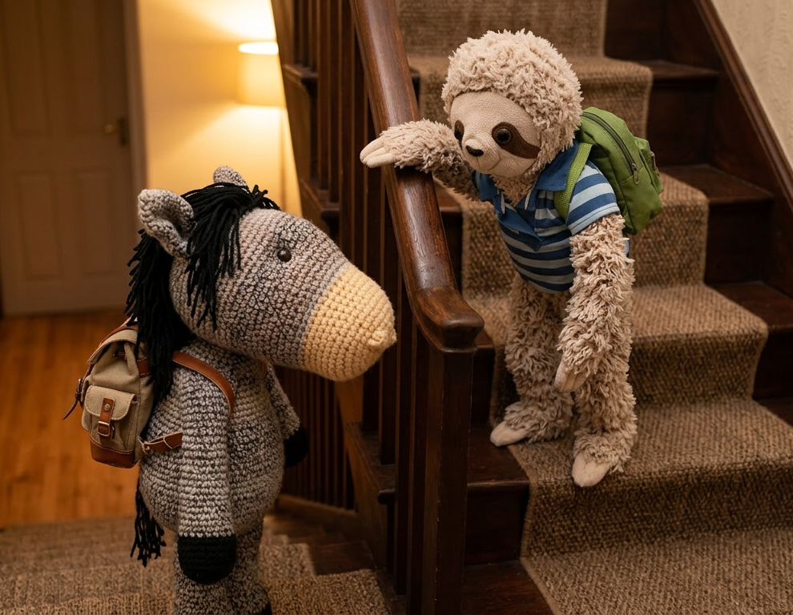 <em>Making Way to Shelter</em></td>
<td align="center">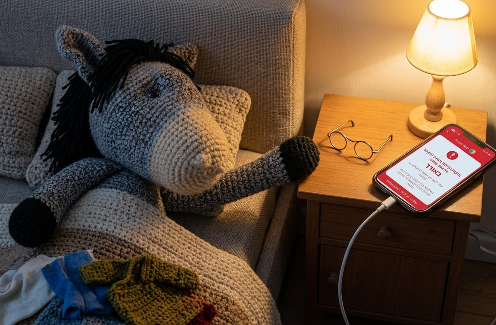 <em>Waking Up to Alert</em></td>
<td align="center">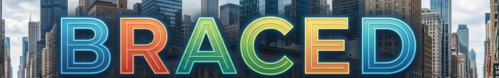 <em>Braced</em></td>
</tr>
<tr>
<td align="center"> <em>Wellness</em></td>
<td align="center">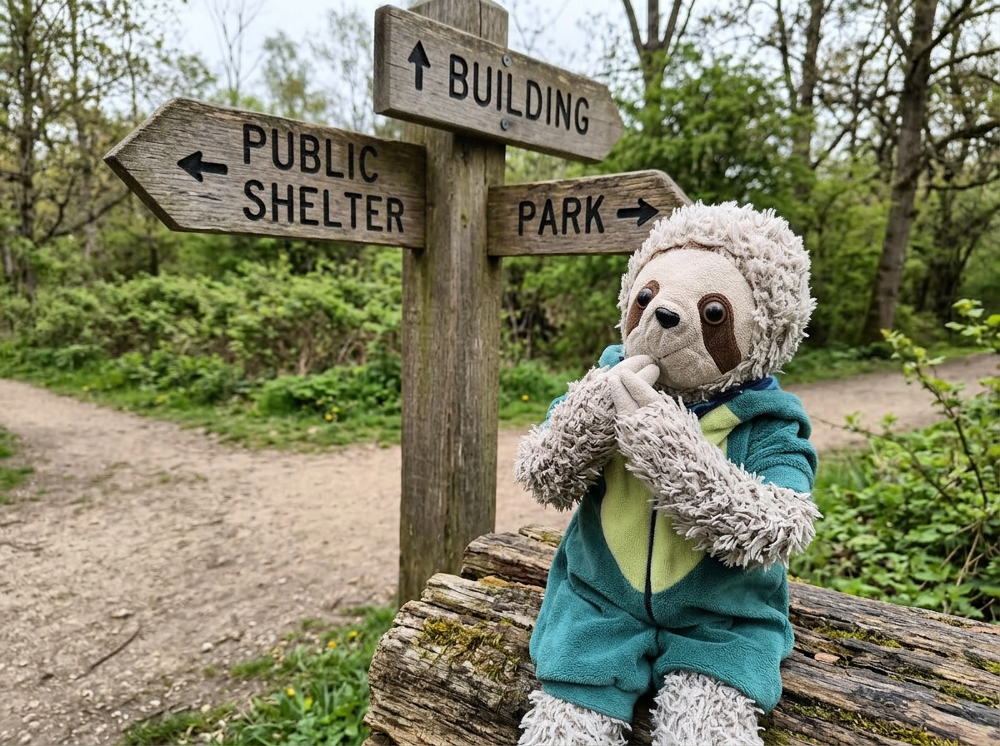 <em>Which Shelter</em></td>
<td align="center">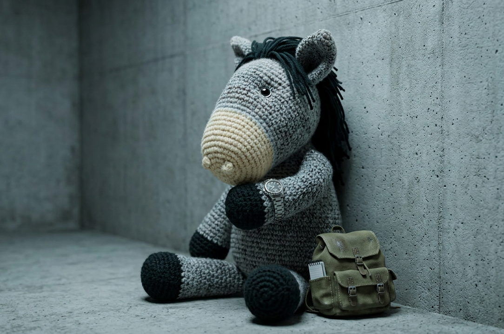 <em>Leaving Shelter</em></td>
</tr>
<tr>
<td align="center"> <em>Daytime Posture</em></td>
<td align="center"> <em>Before Bed</em></td>
<td align="center">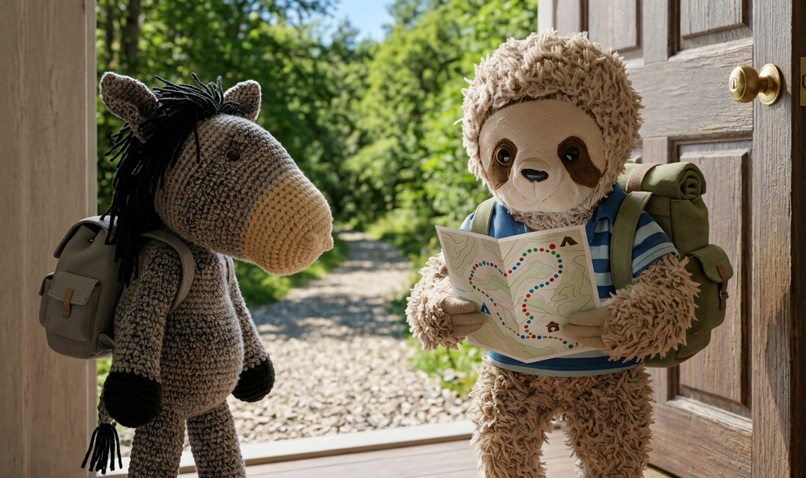 <em>Before Leaving</em></td>
</tr>
<tr>
<td align="center"> <em>Before Shower</em></td>
<td align="center">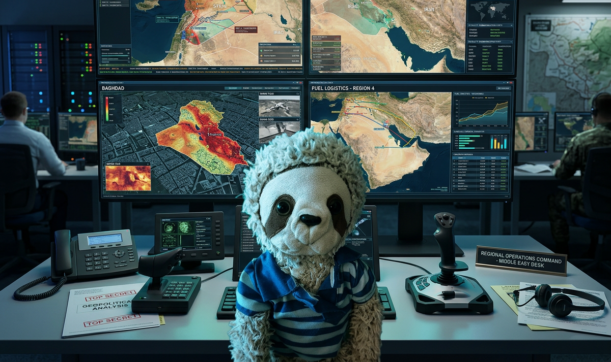 <em>Situational Awareness</em></td>
<td align="center"> <em>Red Alert on Couch</em></td>
</tr>
<tr>
<td align="center"> <em>Returning Home</em></td>
<td align="center">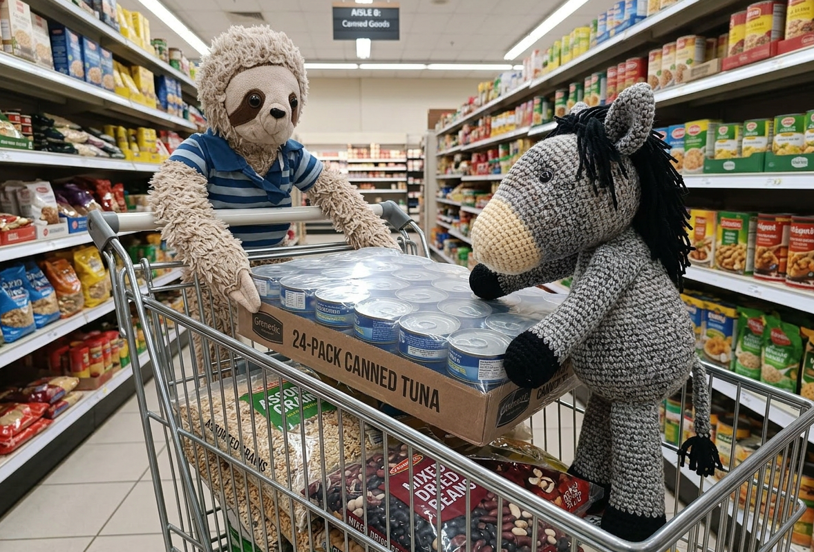 <em>Resupplying</em></td>
<td align="center">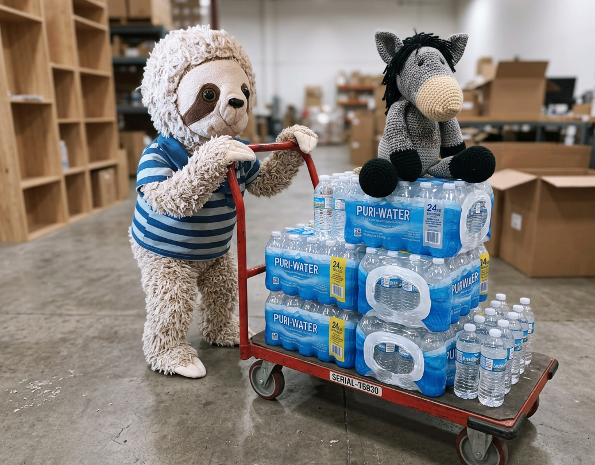 <em>Water Stock Up</em></td>
</tr>
<tr>
<td align="center">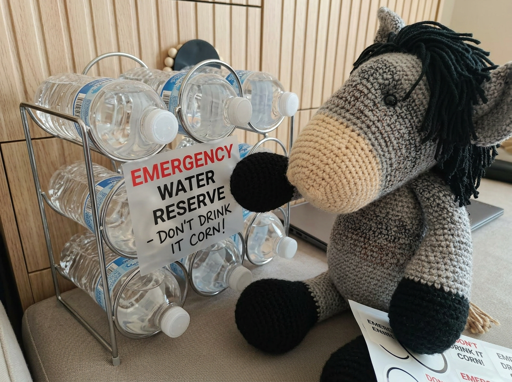 <em>Emergency Water Reserve</em></td>
<td align="center">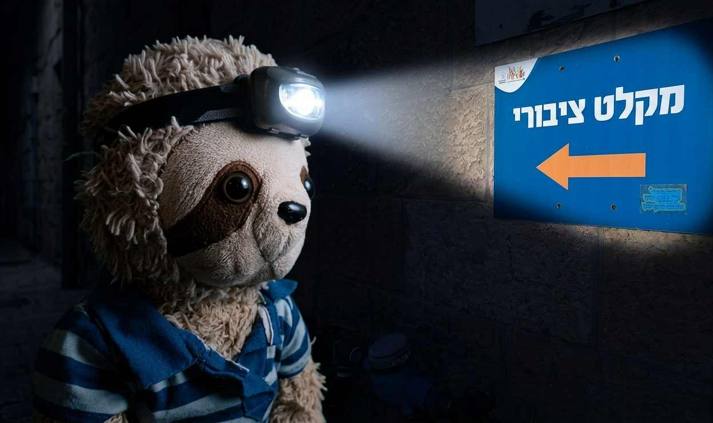 <em>Head Lamp</em></td>
<td align="center">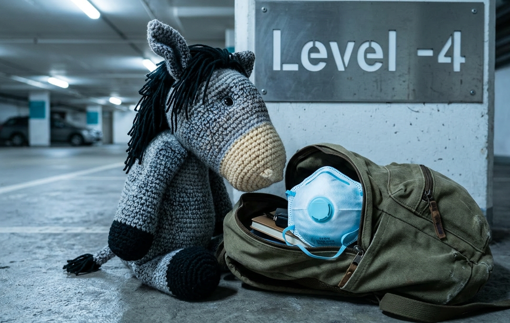 <em>N95 in Backpack</em></td>
</tr>
<tr>
<td align="center">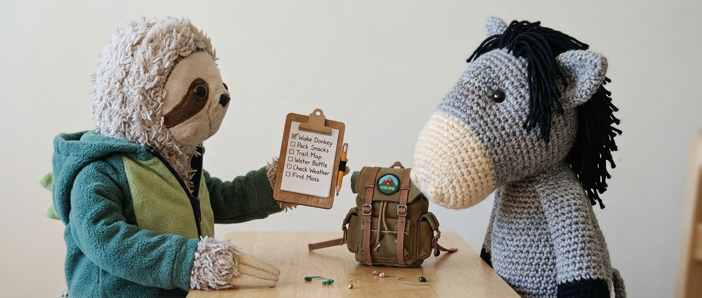 <em>Using Checklists</em></td>
<td align="center">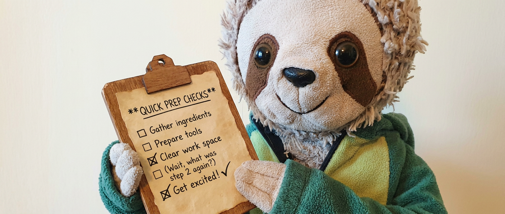 <em>Quick Checks</em></td>
<td align="center">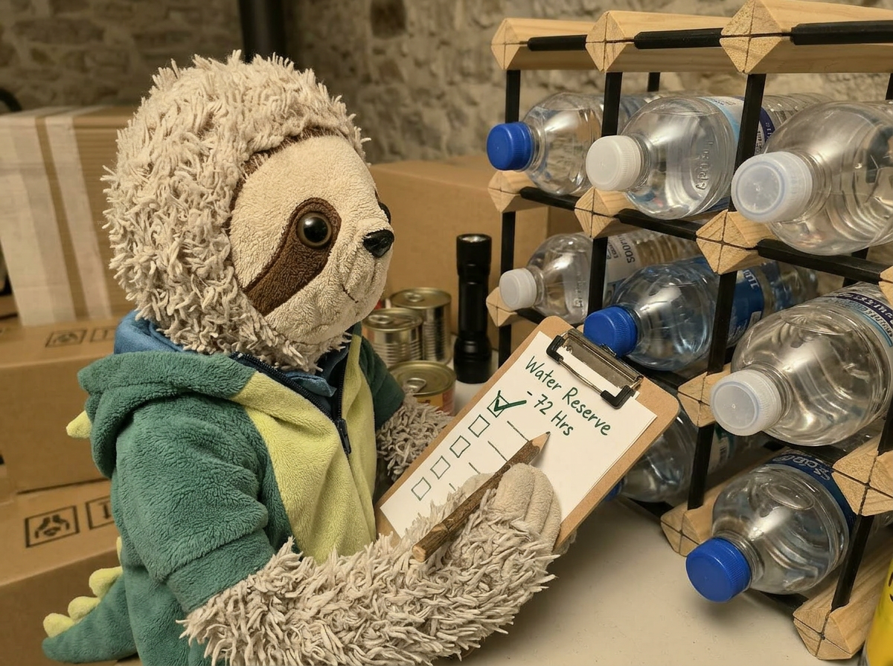 <em>Regular Checks</em></td>
</tr>
<tr>
<td align="center">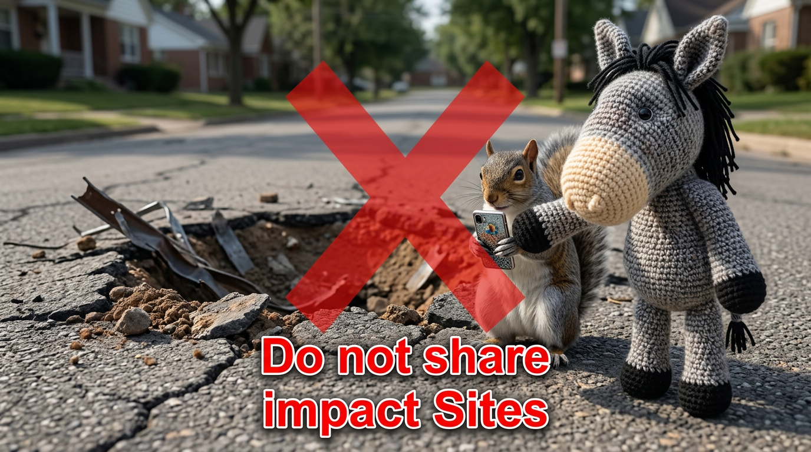 <em>Infosec</em></td>
<td align="center"> <em>Shabbat</em></td>
<td align="center"> <em>Bathing Children</em></td>
</tr>
</table>
